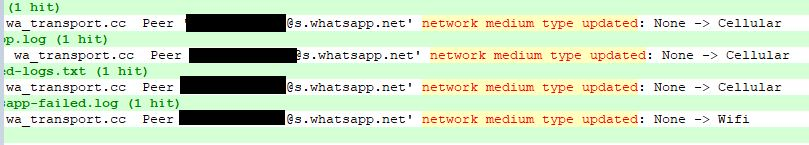

# WaIP - get party IP addrs
(c) leosol 2021

With the help of [jpclaudino](https://github.com/jpclaudino), jkoya and [otaviomaciel](https://github.com/otaviomaciel)

## Main idea
Its known that, besides the fact that every WhatsApp call is encrypted, sometimes packets carrying call data go through a kind of STUN/TURN protocol.

This has been reported by [Marvin Schirrmacher](https://medium.com/@schirrmacher/analyzing-whatsapp-calls-176a9e776213).

There's also something about it at [ntop project](https://github.com/ntop/nDPI/issues/530)

And also [here](https://techbriefly.com/2021/07/14/this-security-flaw-in-whatsapp-could-leak-your-ip-address/) 

As a consequence, sometimes, **it's [sometimes] possible to identify each party IP address**. 

# WaIP tool
It was not only possible to check this, but we built a tool that can be used to try to identify each party IP address.
As the picture shows, it's possible to be ready to identify parties IP addresses during a call.

# Forensic Evidence
WhatsApp leaves a forensic evidence of the IP address used during the call handled by STUN/TURN.
See the binding info that is recorded in the WhatsApp internal logs. When STUN/TURN succeds, **WhatsApp registers a 0x102 code** in it's internal log files.
For the forensic examiner, this might be very usefull since sometimes each party phone number is known, but the investigators have no idea of a physical address. In this case, finding a party IP address can be very useful.
It's also possible to get info about party network, if it's Cellular or Wifi.

# Download
[waip-2021-10-18.apk](https://github.com/leosol/waip/raw/main/dist/waip-2021-10-18.apk)

# Install
- Phone must be rooted
- Needs to allow adb install and not verify apps installed by usb
- ``adb install waip.apk``

# First Filter

``tshark -r /sdcard/capture.pcap stun | grep 'Binding' |tr -s ' '|cut -d ' ' -f 3-5 | sort -u``

``grep -Eio 'Local:(.*), Remote:(.*), priority: 0x102' /data/data/com.whatsapp/files/Logs/whatsapp.log``

``grep -Eio 'Peer (.*) network medium type updated: (.*)'``

# Second Filter

``tshark -r /sdcard/capture.pcap -o gui.column.format:"Source","%us","source port","%uS","Destination","%ud","dest port","%uD" 'udp.port==3478||tcp.port==3478'|busybox awk 'BEGIN{OFS=""}{print $1,":",$2,"  ->  ",$3,":",$4;}' ``

# Limitations

It's not true that every call uses STUN/TURN. This means: do not expect to have the other party IP address every time.
